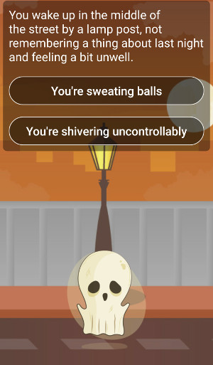
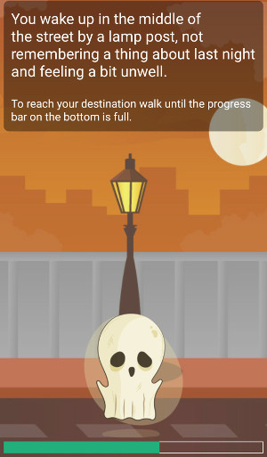
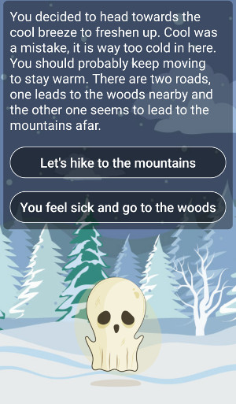

# WalkPast
[](https://badge.fury.io/gh/tundet%2Fwalkpast)
[](https://opensource.org/licenses/MIT)


Is an interactive story game for android that uses sensors and requires the player to move around in real life to get forward in the story.
The project was created to test various android functions and features, while building a well-rounded fun game.
<p align="center">
  
  
  
</p>

## Project includes

* BT-communication to external sensor
* Phone’s internal step counter sensor
* Accessibility taken into consideration during development
* SQLite database
* Clean code
* Fragments
* Connection to some API
* Asynchronous tasks
* Multiple language support (EN & FI)

## Requirements & Dependencies
* MetaWear Sensor Accelerometer 3.1.0 (optional)
* Minimum Android 5.0 API 21
* Targeted Android 8.0 API 26
* Picasso 2.5.2
* LoremAvatar API (currently service down, replaced with placeholder)

## Installation

### 1. Clone the project
```sh
git clone git@github.com:/tundet/walkpast.git
```

### 2. Run the project

**Android Studio:** Go to Run --> Run 'MainActivity' --> Select desired device from list

Or 

**Compile on the command line:** [Instructions](https://developer.android.com/studio/build/building-cmdline.html)

**Note**: Tested only on Samsung Galaxy S5 API 23

## Schedule and issues
[Trello Board](https://trello.com/b/tAaesoy9/walkpast) 
The cards are connected to commits done on github.  
Labels are Not Done (red), In Progress (yellow) and Done (green).
New ideas are welcomed.

## UI and UX documentation
[Only visible for Metropolia students](https://docs.google.com/a/metropolia.fi/document/d/19tY3G-ByqmQkliVcM3lVjWEUT2q8Ct62Z6aoNd20kz4/edit?usp=sharing)

## License
This project is licensed under the MIT License - see the [LICENSE.md](LICENSE.md) file for details

## Acknowledgements and Credits
* Backgrounds by [Frebers.com](http://www.frebers.com/)
* Player characters from [Lorem Avatar](http://loremavatar.com/) API
